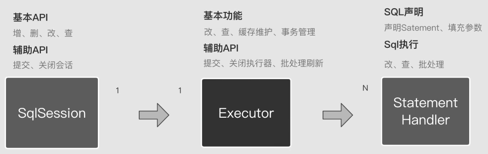

MyBatis SQL Mapper Framework for Java
=====================================

The MyBatis SQL mapper framework makes it easier to use a relational database with object-oriented applications.
MyBatis couples objects with stored procedures or SQL statements using a XML descriptor or annotations.
Simplicity is the biggest advantage of the MyBatis data mapper over object relational mapping tools.

Essentials
----------

* [See the docs](http://mybatis.github.io/mybatis-3)
* [Download Latest](https://github.com/mybatis/mybatis-3/releases)
* [Download Snapshot](https://oss.sonatype.org/content/repositories/snapshots/org/mybatis/mybatis/)

# 源码阅读
> 注意：存于项目中的相关文件似乎都存于https://raw.githubusercontent.com 中，需要FQ，则图片可正常显示
- [Mybatis执行器](doc/executor.md)
- [一级缓存](doc/level1-cache.md)
- [二级缓存](doc/level2-cache.md)
- [StatementHandler](doc/statement-handler.md)
## Mybatis执行过程总结

- Executor的目的就是处理共性（缓存、事务、重用jdbc处理器statement、获取连接等）
- 什么情况下会调用批处理刷新flushStatements？只有当你使用了批处理执行器的进行批处理操作之后。

提到SqlSession和Executor，但实际上真正与JDBC打交道的组件是StatementHandler。JDBC平常主要做的三步就是：
1. 获取statement（JdbcStatement）
2. 设置参数
3. 执行（改、查、批处理）

同样的，statement其实也是在做这三步操作。而SqlSession、Executor和StatementHandler的关系是1：1：N，即使Executor使用的是ReuseExecutor，
那它也是会产生多个的StatementHandler，ReuseExecutor只是决定了StatementHandler对Statement进行重用。还有一种情况就是如果走了缓存，
那么对应的StatementHandler就不存在了。

