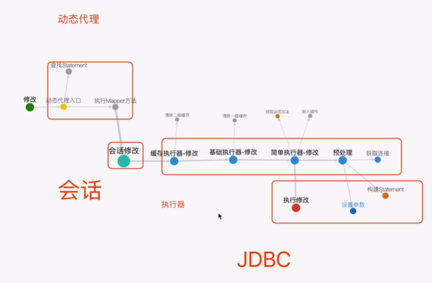

# Mybatis执行器1
## jdbc执行过程
获取连接（Connection）——>预编译SQL（PrepareStatement）——>设置参数——>执行SQL（ResultSet）
## Mybatis执行过程主要分为四个模块
1. 动态代理 MapperProxy
2. SQL会话 SqlSession
3. 执行器 Executor
4. JDBC处理器 StatementHandler

