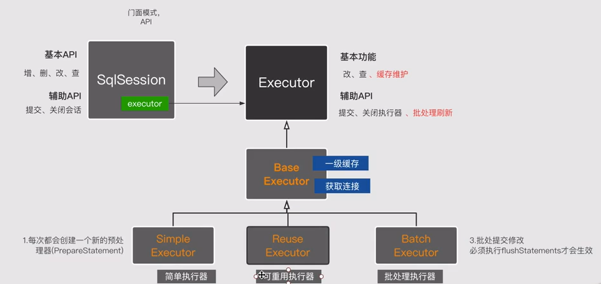
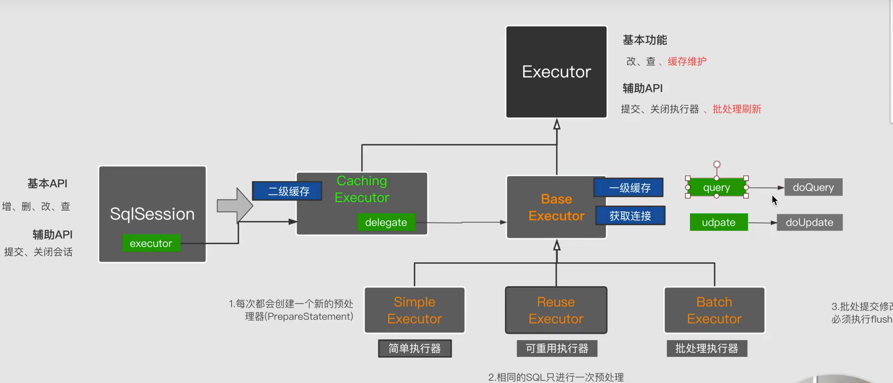
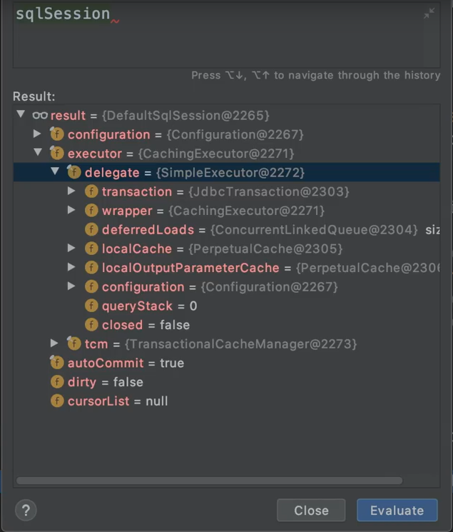

# Mybatis执行器
## jdbc执行过程
获取连接（Connection）——>预编译SQL（PrepareStatement）——>设置参数——>执行SQL（ResultSet）
## Mybatis执行过程主要分为四个模块
1. 动态代理 MapperProxy
2. SQL会话 SqlSession
3. 执行器 Executor
4. JDBC处理器 StatementHandler


## Mybatis Executor
### 基层实现类（SimpleExecutor、ReuseExecutor、BatchExecutor）
- [Executor 执行器接口](../src/main/java/org/apache/ibatis/executor/Executor.java)
    - [SimpleExecutor 简单执行器](../src/main/java/org/apache/ibatis/executor/SimpleExecutor.java)：每次都会创建一个新的预处理器
    - [ReuseExecutor 可重用执行器](../src/main/java/org/apache/ibatis/executor/ReuseExecutor.java)：相同的SQL只进行一次预处理
    - [BatchExecutor 批处理执行器](../src/main/java/org/apache/ibatis/executor/BatchExecutor.java)：批处理提交修改，必须执行flushStatements才会生效

## 基础执行器BaseExecutor
看Executor的时候，会发现带有缓存的一些方法，那么为了让上面三个实现执行器能和缓存结合使用，就可以抽象出一个类，专门实现缓存相关的逻辑。
那么Mybatis里面就会抽象出一个叫[BaseExecutor 基础执行器](../src/main/java/org/apache/ibatis/executor/BaseExecutor.java)
那这个执行器就会去实现上面提到的三个执行器里面一些重复的操作，重复的操作包括有：
- 一级缓存
- 获取连接
> 当直接用具体实现的执行器的doQuery或doUpdate的时候，就不走缓存；但是用query和update的时候（因为这两个方法主要是在它们的父类BaseExecutor
>里进行实现的）就可以用到缓存

所以Mybatis中执行器整体的层级结构就变成了如下图所示：
 

## 缓存执行器CacheExecutor
那么Mybatis又是如何实现二级缓存的呢？<br>
就是用的[CachingExecutor 缓存执行器](../src/main/java/org/apache/ibatis/executor/CachingExecutor.java)。那么，结构图便变成：


## SqlSession会话
那实际使用中，我们一般不会直接去用执行器，而通常会用[SqlSession](../src/main/java/org/apache/ibatis/session/SqlSession.java)进行操作，
SqlSession的作用就是降低调用的复杂性。我们关注下该接口的默认实现[DefaultSqlSession](../src/main/java/org/apache/ibatis/session/defaults/DefaultSqlSession.java)。
 使用示例：
 ```
Sqlsession sqlSession = factory.openSession(true)
// 具体根据需要调用SqlSession对象中的方法
……
```
直接使用SqlSession，调试的时候会发现，SqlSession中的executor属性默认为CachingExecutor，而CachingExecutor里的delegate默认就是SimpleExecutor。如下图所示：

那么如果具体的BaseExecutor类型我不想使用默认的SimpleExecutor，那要如何进行修改呢？[SqlSessionFactory](../src/main/java/org/apache/ibatis/session/SqlSessionFactory.java)
提供了很多openSession的重载方法，例如可以指定具体的BaseExecutor类型，如下所示：
```
Sqlsession sqlSession = factory.openSession(ExecutorType.REUSE, true)
// 具体根据需要调用SqlSession对象中的方法
……
```