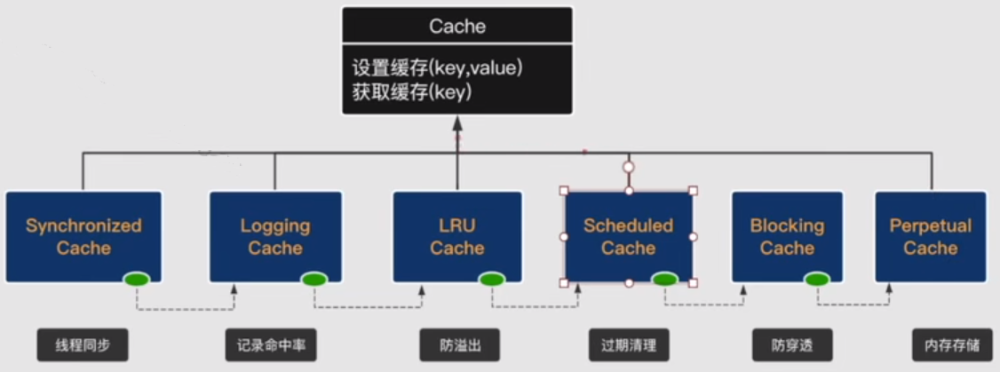

# 二级缓存
二级缓存也称作应用级缓存，与一级缓存不同的是它的作用范围是整个应用，而且可以跨线程使用。所以二级缓存有更高的命中率，所以适合一些修改较少
的数据。

一级缓存的应用周期是在会话，也就是说一旦会话结束了，那么一级缓存也就消亡了。而且一级缓存的作用范围是有限的，它不能进行跨线程的使用。因为
会话本身就不是线程安全的。

所以二级缓存相较于一级缓存，功能就会更完整一些，包括存储的方式、一级缓存只能通过内存来进行存储。由于二级缓存的生命周期是整个应用，所以必
须限制二级缓存的容量。那既然要限制容量，就必须要用溢出淘汰的机制。
## 二级缓存扩展性需求
### 存储
将二级缓存存储在内存中的话，会很容易随着应用的结束而被销毁，所以需要做持久化，即缓存也需要保存到硬盘中。就像Nginx其缓存就是保存到硬盘中，
当然这里都是指内存和硬盘一起协作使用。然后还有遇到分布式应用的话，就需要用到分布式缓存，此时，二级缓存便需要去支持第三方集成。

### 溢出淘汰
上面提到，二级缓存由于作用于整个应用，所以缓存的大小必须有所限制，这样才不会导致内存被撑爆。但是一直往二级缓存里加数据，总会到达限定值的，
此时，就需要去作一些清除淘汰缓存的操作。所以就需要一些溢出淘汰的算法，最简单的就是FIFO（Fast In Fast Out先进先出算法），还有一个比较耳
熟的算法就是LRU（Least Recently Used 最近最少使用）。

### 过期清理
如果数据放的时间过久，比如都一年前的数据放在缓存里面，那这个数据很有可能在数据库里已经变更过了，所以必须给数据设置保质期，哪怕容量没有满，
也要清理掉。

### 线程安全
二级缓存是多个线程可以同时访问的，它是可以跨线程的，所以它就需要去保证线程安全。

### 命中率统计
我们用缓存，就是为了高命中来提高查询性能。如果都没有命中，就需要调整相关的缓存策略。所以需要有命中率统计来帮助。

### 序列化
跨线程，两个对象之间不能完全一样，如果完全一样很容易导致数据的混乱。

### 其他等等
主要的就是上面提到的几点，当然还有其他一些需求，后面具体看源码再说。

## Mybatis如何实现缓存
首先，它有一个顶层接口[Cache](../src/main/java/org/apache/ibatis/cache/Cache.java)，方法十分简单。

那么Mybatis又是怎么实现上述提到的需求的呢？这里采用装饰器+责任链的设计模式。

- SynchronizedCache：对应线程安全
- LoggingCache：对应命中率统计
- SerializedCache：对应做序列化的
- LRU Cache：对应防溢出，LRU为默认的溢出淘汰策略
- ScheduledCache：对应过期清理（需要设置上才会被使用，默认不过期）
- BlockingCache：防穿透，防止缓存穿透的，比较复杂
- Perpetual：内存清理，默认用内存存储，底层实现其实是就是HashMap

如上图，从左到右，每一个缓存都通过装饰器的模式指向下一个缓存，所以缓存的功能会挨个根据不同的功能组件做不同的处理，这就是所谓的责任链。

示例代码
```
Cache cache = configuration.getCache({具体的id});
User user = Mock.newUser();
cache.putObject("test", user);
cache.getObject("test");
```
无论是putObject方法还是getObject方法，它都会沿着上面图的链条往下进行。
## 二级缓存使用缓存与命中场景
### 二级缓存命中条件
- 运行时参数相关
    1. 会话提交后（session.commit 自解：前提条件，数据才能设置进缓存去；session.close也会设置缓存；）
    2. Sql语句，参数相同
    3. 相同的statementID
    4. RowBounds相同
    
除了第1点，基本上条件和一级缓存一样。

| 二级缓存配置表|   | 
|-------- | --------|
| CacheEnabled | 全局缓存开关 默认true |
| useCache | statement缓存开关 默认true  |
| flushCache | 清除默认：修改true；查询false  |
| <cache/>或@CacheNameSpace | 声明缓存空间 |
| <cache-ref/>或@CacheNameSpaceRef | 引用缓存空间